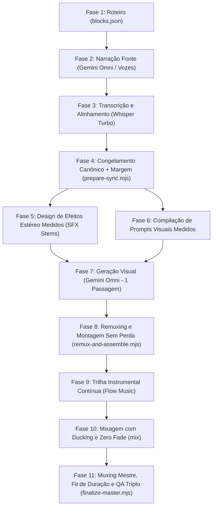

# Padrão de Pipeline Audio-First para Produções Multi-Capítulos

> **Especificação Canônica do Pipeline Audiovisual de Alta Precisão**
> Este documento registra a arquitetura padrão para criar produções modulares sincronizadas por narração real (Audio-First), adaptável a qualquer estilo visual, estética ou conceito criativo.

---

## 1. Princípio Fundamental

> **"A voz é a timeline mestre. O vídeo, os efeitos e a música obedecem aos timestamps medidos da narração."**

Em vez de gerar vídeos primeiro e tentar encaixar o áudio depois — ou inventar timecodes teóricos no prompt —, o pipeline Audio-First garante sincronismo milimétrico através de 11 fases estritas:



---

## 2. Separação de Responsabilidades (Engine vs. Style)

O pipeline desacopla o **Motor Áudio-Primeiro** da **Bíblia Artística**:

1. **Motor Áudio-Primeiro (Reutilizável/Invariável)**:
   - Mecânica de alinhamento Whisper.
   - Lead-in de proteção (0.5s).
   - Geração de SFX estéreo alternado em 3 âncoras (primeira palavra, palavra central, última palavra).
   - Remux descartando áudio Omni e aplicando stream-copy na concatenação.
   - Mixagem com Ducking (ratio 8, music gain ~0.11, sfx gain ~0.30) e zero fade.
   - Verificação estrita de QA (`ffprobe`, contagem exata de frames, decodificação integral `ffmpeg NUL`).

2. **Estilo Visual e Criativo (Variável por Projeto)**:
   - `themes` / `StyleSpec`: Define o tipo de **Objeto Hero**, **Ambiente/Paleta**, **Movimento de Câmera**, **Tipografia Nativa** e **Regras de Exclusão**.
   - `flow-prompt.txt`: Define a assinatura sonora da trilha instrumental no Flow Music.

---

## 3. Matriz de Contrato por Estilo Visual

Ao iniciar um novo projeto, defina um arquivo `theme-spec` contendo os atributos do estilo escolhido:

| Atributo | Exemplo: UI SPACE | Exemplo: Aquarela 2D | Exemplo: Cyber Kinetic | Exemplo: 3D Arquitetônico |
| --- | --- | --- | --- | --- |
| **Ambiente** | Preto mineral, ciano luminoso | Papel textura fria, manchas fluidas | Néon denso, grade volumétrica | Concreto cinzento, luz solar rasante |
| **Objeto Hero** | Painel / Interface monumental | Ilustração orgânica viva | Vórtice de luz e circuitos | Bloco arquitetônico com profundidade |
| **Ocupação de Quadro** | 55% a 75% | 50% a 70% | 60% a 80% | 50% a 75% |
| **Tipografia Nativa** | 2 palavras nativas gigantes | Rótulo em pincelada orgânica | Glitch luminoso limpo | Inscrição entalhada na estrutura |
| **SFX Frequências** | Sub 62 Hz + Rosa 700-6.5k Hz | Sub macio + Pincelada limpa | Sub sintético + Pulso digital | Impacto mineral + Ressonância |

---

## 4. O Roteiro e o Alinhamento

### 4.1 Formato de Roteiro (`blocks.json`)
```json
[
  {
    "id": "projeto-01-capitulo",
    "text": "Frase curta e impactante em português brasileiro, entre 8 e 12 palavras."
  }
]
```

### 4.2 Matriz de Tratamento de Divergências de Voz
| Ocorrência no Whisper | Ação Exigida |
| --- | --- |
| **Grafia diferente** (mesma fala) | Manter grafia oficial do roteiro, preservando o timestamp. |
| **Artigo natural falado** (ex: "chama a atenção") | Atualizar `blocks.json` com o artigo e re-alinhar localmente. |
| **Palavra trocada / omitida / repetida** | Bloquear o capítulo. Regenerar a narração fonte daquele capítulo em pasta isolada de reconciliação. |

---

## 5. Estrutura de Pastas Padrão de um Projeto

Para cada novo projeto, crie a seguinte estrutura em `CORE/producoes/` e `CORE/outputs/`:

```text
CORE/producoes/<nome-do-projeto>/
├── README.md                  # Descrição e especificações do projeto
├── blocks.json               # Roteiro em blocos de capítulos
├── flow-prompt.txt           # Prompt para geração da trilha no Flow Music
├── prepare-sync.mjs          # Script de sincronização, WAVs canônicos e prompts
├── remux-and-assemble.mjs    # Script de remux com voz canônica e montagem unido.mp4
└── finalize-master.mjs       # Script de mixagem, fit de duração, muxing e QA final

CORE/outputs/<nome-do-projeto>/
├── narracao-fonte/           # MP4s originais com narração bruta do Omni
├── alinhamento/
│   ├── fonte/                # Primeiro passe Whisper
│   └── final/                # Alinhamento final aprovado (10/10)
├── audio/
│   ├── *.wav                 # Narrações canônicas com 0.5s de lead-in
│   ├── sfx-partes/           # Stems de efeitos estéreo por capítulo
│   ├── *-sfx-master.wav      # Master concatenado dos efeitos
│   ├── *-flow.wav            # Trilha contínua do Flow Music
│   ├── *-mix.wav             # Mix estéreo (voz + música + SFX)
│   └── *-mix-fit.wav         # Mix ajustado à duração exata do vídeo
├── originais-omni/           # Vídeos visuais gerados pelo Omni (áudio descartado)
├── videos-soltos/            # Capítulos individuais narrados e sincronizados
├── videos-unidos/            # Vídeo concatenado sem perda + Master final
├── receitas/                 # Recibos auditáveis (.receipt.json) de todas as fases
└── metadados/                # Relatórios técnicos, manifesto e timing-report
```

---

## 6. Checklist de Execução e QA (Definition of Done)

Toda nova produção deve cumprir os 10 critérios de aceitação técnica:

- [ ] **Roteiro & Voz**: `blocks.json` validado e narração gerada sem truncamento.
- [ ] **Alinhamento 100% Pass**: Whisper Turbo confirma 100% dos blocos como `pass`.
- [ ] **Timestamps Reais**: Prompts visuais e SFX usam apenas timestamps medidos do Whisper (zero timecodes inventados).
- [ ] **Lead-in Técnico**: 0,5 s de silêncio de proteção adicionado antes de cada narração.
- [ ] **Visual 1 Passagem**: Visuais Omni gerados uma única vez em modo `raw`, com 1 objeto Hero proeminente.
- [ ] **Substituição de Áudio**: Áudio nativo do Omni 100% descartado e substituído pela narração canônica.
- [ ] **Concatenação Stream-Copy**: Montagem dos capítulos concatenada por cópia de stream sem re-codificação de vídeo.
- [ ] **Trilha Flow Sob Medida**: Música gerada no Flow Music para a duração exata do vídeo unido.
- [ ] **Mixagem Profissional**: Voz no centro, Ducking ratio 8, LUFS entre −14 e −16 dB, True Peak < −3 dB, zero clipping, zero fade.
- [ ] **QA Triplo**: `ffprobe` validado, contagem exata de frames atingida (ex: 2.400 frames para 100s a 24 fps) e decodificação integral FFmpeg sem erros.

---

## 7. Registrado em
- **Validação**: testado num filme de dez capítulos de dez segundos, com alinhamento 10/10.
