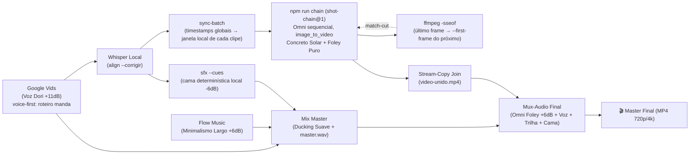

# 🜂 Receita de Âmbar: Spot em Plano-Sequência Contínuo — Concreto Solar & Gravidade Rotativa

> **Identificador Canônico:** `spot-plano-sequencia-concreto-solar`
> **Aliases Propostos:** `ambar`, `receita-ambar`, `concreto-solar`, `gravidade`, `plano-sequencia`, `uma-tomada`
> **Classificação:** Contraponto oficial da Receita de Ouro — mesmo rigor de pipeline, gramática audiovisual oposta.
> **Destino:** Peças de marca com respiração cinematográfica, onde a **continuidade** é o argumento de venda, não o corte.

---

## 0. Por Que Esta Proposta É Diferente (o diagnóstico que a motivou)

Os dez conceitos já produzidos no estúdio — `spot-01-cyberpunk-hud`, `spot-02-swiss-brutalist`, `spot-03-liquid-chrome`, `spot-04-paper-craft`, `spot-05-retro-synthwave`, `spot-06-apple-glass`, `spot-07-kinetic-bauhaus`, `spot-08-quantum-particles`, `spot-09-cinematic-nolan`, `spot-10-acid-y2k-chrome` — compartilham **o mesmo esqueleto de prompt**, palavra por palavra:

```text
Ultra-high-end 8k resolution <ESTILO> animation, 10s duration. Visual Concept: <TEXTURA>, zero human figures.
[NEGATIVE AUDIO PROMPT: ...] Precise timeline:
0.0s-2.0s: emblema entra | 2.0s-4.5s: tipografia corta | 4.8s-5.8s: destaque | 6.3s-10.0s: transição
```

Ou seja: **dez peles sobre um único esqueleto**. A criatividade ficou toda na textura; a gramática nunca mudou — sempre 4 cenas independentes, sempre a mesma batida de tempos, sempre corte seco entre blocos.

A Receita de Âmbar não propõe uma décima primeira textura. Ela troca **a gramática**:

| Eixo | 🏆 Ouro (Quantum Glass) | 🜂 Âmbar (Concreto Solar) |
| :--- | :--- | :--- |
| **Montagem** | 4 cenas independentes, corte seco | **1 plano-sequência**, 3 match-cuts invisíveis |
| **Matéria** | Vidro 3D, obsidiana, neon, estúdio escuro | Concreto bruto, sol real, céu, sombra projetada |
| **Estratégia de áudio** | `music-first` (o roteiro se adapta à trilha) | **`voice-first`** (o roteiro é intocável) |
| **Cadência** | 2,4 pal/s, sem respiro | 2,0 pal/s + **1,5 s de silêncio** antes da 1ª palavra |
| **Camadas sonoras** | 3 | **4** (entra a cama SFX local determinística) |
| **Sincronia** | Cue sheet escrito à mão | **`sync-batch`** remapeando Whisper por clipe |
| **Voz** | Jett `+15 dB` (autoridade que impõe) | Dori `+11 dB` (autoridade que convida) |
| **Trilha** | Híbrido épico de metais | Minimalismo largo: drone grave, cello sustentado, ar |
| **Geração** | `--parallel 4` (~45 s) | **Sequencial obrigatória** (~3 min) — o preço da continuidade |

> **A tese:** um corte é uma promessa quebrada de espaço. Quando a câmera **nunca corta**, o espectador não consegue localizar o momento em que foi convencido — e é exatamente aí que a peça vence.

---

## 1. Visão Geral da Arquitetura

Cinco motores, um a mais que a Receita de Ouro (entra a cama SFX local e o remapeador de timestamps):



---

## 2. Parâmetros Acústicos & Multicamadas

A assinatura sonora ganha uma **quarta camada** — a única 100% determinística e auditável do conjunto:

| Camada | Motor / Provedor | Ganho | Função Acústica |
| :--- | :--- | :--- | :--- |
| **1. Locução Principal** | Google Vids (`Dori`) | `+11 dB` | Grave e expressiva, próxima do microfone. Autoridade que convida em vez de impor. |
| **2. Trilha Sonora** | Flow Music | `+6 dB` | Minimalismo largo: drone sub-grave, cello sustentado, percussão esparsa. Recua para a voz existir. |
| **3. Foley Nativo** | Gemini Omni | `+6 dB` | Som do mundo físico: atrito de pedra, vento em vão de concreto, estalo de pedra ao sol. |
| **4. Cama SFX Local** | `sfx --cues` (ffmpeg) | `-6 dB` | Âncoras **frame-exatas** nos 3 match-cuts. Determinística: mesmo cue-sheet, mesmo WAV, sempre. |

**Por que a camada 4 existe:** o Omni acerta a *textura* do som, mas nunca o *milissegundo*. Os três giros de gravidade precisam de impacto no frame exato — isso o `sfx --cues` entrega por construção, porque compila `atMs` direto no filtergraph do ffmpeg.

> **Estado do acervo local:** a biblioteca em `CORE/assets/sfx/` tem hoje 5 sons — `boom`, `glass`, `glitch`, `tick`, `whoosh`. O conceito é **executável já** usando `boom` (impacto de gravidade) e `whoosh` (a passagem). Dois WAVs novos elevariam o resultado: `vento-vao.wav` e `pedra-atrito.wav`.

---

## 3. Cadência Temporal & Estrutura de Roteiro

* **Cadência Respirada:** **2,0 palavras por segundo** — 17% mais lenta que a Ouro. O espaço vazio é parte da peça.
* **Silêncio de Abertura:** os primeiros **1,5 s não têm voz**. Só sol, concreto e vento. A peça começa antes de falar.
* **Cauda Muda:** os últimos **4,0 s não têm voz** (`tailSeconds: 4.0`). Imagem e trilha fecham sozinhas.
* **Estratégia `voice-first` (decisão crítica):** a trilha é gerada *para caber no roteiro*, e não o contrário.

> ⚠️ **A razão técnica de não usar `music-first` aqui:** em `audio-recipe.mjs`, quando o roteiro é mais curto que a trilha, `adaptScriptForDuration()` injeta blocos de expansão **de varejo hardcoded** ("descontos reais de até setenta por cento", "parcelamento em vinte e quatro vezes"). Isso salva um spot de liquidação e destrói uma peça autoral. Em `voice-first` o texto passa intacto para o TTS.

### Distribuição do Plano-Sequência (peça de 40 s)

Não são "4 cenas". São **4 trechos de uma tomada só**, separados por giros de gravidade:

* **Trecho 1 — O CHÃO (0 s a 10 s):** câmera rasante sobre piso de concreto ao sol. As letras **emergem extrudadas do próprio chão**, projetando sombra dura. A câmera sobe e o horizonte começa a inclinar.
* **Trecho 2 — A PAREDE VIRA CHÃO (10 s a 20 s):** a gravidade gira 90°. A parede onde a câmera pousou agora é o piso. A proposta de valor está **pintada em cobalto sobre o concreto**, e a câmera caminha sobre ela.
* **Trecho 3 — O VÃO (20 s a 30 s):** a câmera atravessa a fresta entre dois monolitos. O sol corta lateralmente e **as letras da agenda e do CTA são feitas de sombra projetada**, não de tinta — existem só porque existe sol.
* **Trecho 4 — O CÉU (30 s a 40 s):** a câmera sobe em contra-plongée até os monolitos se alinharem em perspectiva e formarem a marca. Céu azul profundo. Último frame sustentado por 1,5 s.

---

## 4. Conceito Visual: Concreto Solar & Gravidade Rotativa

* **Ambiente:** exterior, **luz solar real e dura**, meio-dia alto. Nenhum estúdio, nenhuma escuridão.
* **Matéria:** concreto bruto aparente, travertino, poeira fina no ar atravessada pelo sol.
* **Céu:** azul profundo saturado (`#0B3D91`), limpo, sem nuvem — dialoga com o cobalto da marca sem imitá-lo.
* **Tipografia:** letras **arquitetônicas em escala monumental**, extrudadas do próprio concreto (a tipografia *é* a construção, não um elemento sobre ela). Tinta cobalto (`#0066FF`) aplicada como pintura industrial em superfície porosa.
* **Sombra como material:** no Trecho 3, o texto existe apenas como sombra projetada — o único "efeito" da peça é físico.
* **Câmera:** **um único movimento contínuo**, lento, sem corte, com leve imperfeição de operador humano.
* **Composição:** monumental, silenciosa, **sem pessoas**, sem interface, sem partícula, sem brilho.

---

## 5. Regras Críticas para o Gemini Omni

### A. Prompt Negativo Estrito de Áudio (herdado da Ouro, obrigatório)
```text
[NEGATIVE AUDIO PROMPT: ABSOLUTELY NO NARRATION, NO VOICES, NO SPOKEN WORDS, NO SPEECH, NO TALKING, NO HUMAN VOCALS. AUDIO IS 100% PURE MOTION SOUND EFFECTS ONLY.]
```

### B. Trava de Plano Único (regra nova — inverte uma alavanca conhecida)
O catálogo de técnicas registra que listar beats como `SHOT n OF 6` faz o Omni **montar 5–6 planos dentro de 10 s**. Aqui essa alavanca é usada ao contrário, e precisa ser explícita ou o modelo corta por conta própria:
```text
[SHOT DISCIPLINE: ONE SINGLE UNBROKEN CAMERA MOVE FOR THE FULL 10 SECONDS. NO CUTS. NO SHOT CHANGES. NO EDITING. NO JUMP IN CAMERA POSITION. ONE CONTINUOUS TAKE ONLY.]
```

### C. Trava de Matéria (`MATERIAL CHECK` por clipe)
Assim como o `RENDER CHECK` protege o flat 2D contra vocabulário 3D, aqui um bloco protege o concreto solar contra a gravitação natural do modelo para o visual escuro/neon:
```text
[MATERIAL CHECK: raw porous concrete, real hard midday sunlight, deep blue sky, cast shadows.
NO neon, NO glow, NO glass, NO chrome, NO dark studio, NO particles, NO lens flare, NO CGI plastic sheen, NO night.]
```

### D. Encadeamento Match-Cut (o coração da receita)
Cada clipe *n+1* recebe como imagem de referência o **último frame** do clipe *n*, e o prompt abre declarando continuidade:
```text
CONTINUOUS SHOT — the reference image is the EXACT first frame of this clip. The camera never stops and never cuts;
it continues the same move already in progress. Gravity rotates 90 degrees during this take: the wall becomes the floor.
```

### E. Fechamento da Marca (regra de marca, inegociável)
A logo do fecho **nunca é inventada pelo modelo**. O Trecho 4 usa a logo canônica como imagem de referência, e o prompt trata a marca como objeto físico já existente na cena — os monolitos se *alinham* até revelá-la, não a *desenham*.

### G. Trava de Enquadramento no Elo de Marca (descoberta na produção do `spot-ambar-v1`)
A bíblia diz *"shot on 35mm anamorphic"*. Nos elos `chain` isso é inofensivo — o frame de referência ancora o enquadramento. No elo `brand`, que **não** recebe frame anterior, o modelo tomou a instrução ao pé da letra e **renderizou a película como objeto**: tarja preta, furos de sprocket e borda laranja de negativo em volta da imagem, nos primeiros ~3 s do clipe.

A correção vai no `action` do elo (não na bíblia, que é o registro do que gerou os elos anteriores) e precisa vir depois dela no prompt, para ter a última palavra:
```text
[FRAMING LOCK, OVERRIDES EVERYTHING ABOVE: the photographed image FILLS THE ENTIRE FRAME edge to edge.
NO film strip, NO sprocket holes, NO film perforations, NO celluloid border, NO letterbox, NO black bars,
NO rounded corners, NO border of any kind, NO frame within a frame, NO camera gate vignette.
Never render the film medium itself as an object.]
```
Junto com a trava, descreva no `action` **a composição final do elo anterior** como abertura obrigatória. Não substitui o frame-lock, mas aproxima a emenda o suficiente para ela ler como corte casado em vez de ruptura.

### F. Cue Sheet de Foley por Segundo (gerado, não escrito à mão)
Diferente da Ouro, os tempos não são digitados: saem do `align` e são remapeados por `sync-batch` para a janela local de cada clipe. Exemplo do Trecho 2:
* `0.0s-1.2s`: rangido grave de massa de concreto girando + vento que muda de direção.
* `1.2s-1.4s`: **impacto seco** no instante exato em que a parede assenta como chão (âncora local `boom`).
* `2.0s-6.5s`: passos de câmera sobre superfície porosa + ar aberto.
* `6.5s-10.0s`: sustentação de vento em vão estreito, sem resolução — a tensão atravessa o match-cut.

---

## 6. Procedimento de Execução Passo a Passo (CLI)

### Passo 1: Síntese de Voz e Trilha (`audio-recipe`, voice-first)
```powershell
npm run video -- audio-recipe `
  --mode studio `
  --preset ambar `
  --text-file "outputs/spot-ambar-v1/textos/roteiro.txt" `
  --collection spot-ambar-v1
```
Rode antes com `--dry-run true` — provider-free — para conferir contagem de palavras e duração estimada sem gastar.

### Passo 2: Alinhamento com Correção Ortográfica (`align`)
```powershell
npm run video -- align `
  --audio "outputs/spot-ambar-v1/audios-soltos/voz.wav" `
  --script-file "caminho/do/roteiro.txt" `
  --out-dir "outputs/spot-ambar-v1/alinhamento" `
  --corrigir true
```
`--corrigir true` adota a grafia do roteiro para palavras foneticamente próximas mantendo os timestamps medidos — o texto publicado continua vindo do roteiro.

### Passo 3: Remapeamento de Timestamps por Clipe (`sync-batch`)
```powershell
npm run video -- sync-batch `
  --recipe "outputs/spot-ambar-v1/metadados/receita.json" `
  --words "outputs/spot-ambar-v1/alinhamento/palavras-master.json" `
  --out-dir "outputs/spot-ambar-v1/metadados/sync-batch" `
  --videos-dir "outputs/spot-ambar-v1/videos-soltos"
```

### Passo 4: Cama SFX Local Determinística (`sfx`)
```powershell
npm run video -- sfx `
  --cues "outputs/spot-ambar-v1/metadados/sfx-cue-sheet.json" `
  --out "outputs/spot-ambar-v1/audios-soltos/cama-sfx.wav"
```

### Passo 5: Geração Encadeada no Omni (`chain`, **não** `batch`)
O estúdio **já tem** o orquestrador do plano-sequência: `scripts/encadear-planos.mjs`, schema `mkt-videos/shot-chain@1`. Ele é sequencial por definição, extrai o frame de corte com `-sseof` do MP4 entregue (nunca de render intermediário), é retomável (clipe já entregue é pulado sem nova chamada) e exige confirmação humana literal em todo elo que envie imagem ao provedor. **Não escreva um encadeador novo.**

Três detalhes que o módulo resolve melhor do que o `batch` faria:
* **A continuidade é imposta pela imagem, não pedida no texto.** Os elos usam `image_to_video` com `--first-frame`; pedir "continue a cena anterior" no prompt o modelo ignora.
* **A bíblia visual inteira entra em todo prompt** (`buildShotPrompt`). Encurtar porque "o modelo já sabe" é o caminho mais rápido para a cadeia derivar de estilo no quarto elo.
* **O fecho de marca usa `role: "brand"`** → `reference_to_video` com a logo canônica.

```powershell
# provider-free: valida a cadeia, mostra os 4 elos e onde a confirmação será exigida
npm run chain -- --spec "outputs/spot-ambar-v1/metadados/cadeia-ambar.json" --out-dir "outputs/spot-ambar-v1/cadeia" --dry-run
```
```powershell
# execução real (paga, sequencial)
npm run chain -- --spec "outputs/spot-ambar-v1/metadados/cadeia-ambar.json" --out-dir "outputs/spot-ambar-v1/cadeia" --confirm-provider-input true
```

> ⚠️ **Armadilha de caminho:** `spec.logo` é resolvido com `path.resolve()` contra o **CWD**, não contra a pasta da spec. Escreva o caminho relativo à raiz do `CORE` (`outputs/<colecao>/logo/...`), ou a logo aponta para fora do projeto e o elo de marca quebra.

> ⚠️ **Limite conhecido do fecho:** `role: "brand"` tem `needsPreviousFrame: false` — o elo 4 recebe a logo, **não** o frame final do elo 3. Ou seja, a única junção que não é travada por imagem é a última. Fidelidade de marca vence continuidade aqui (a logo nunca pode ser inventada), mas é exatamente essa emenda que o Passo 8 precisa auditar primeiro.

### Passo 6: Concatenação Stream-Copy (`join`)
```powershell
npm run video -- join `
  --mode studio `
  --manifest "outputs/spot-ambar-v1/metadados/assembly-manifest.json" `
  --out "outputs/spot-ambar-v1/videos-unidos/video-unido.mp4"
```

### Passo 7: Masterização Multicamadas (`mux-audio`)
```powershell
npm run video -- mux-audio `
  --mode studio `
  --video "outputs/spot-ambar-v1/videos-unidos/video-unido.mp4" `
  --audio "outputs/spot-ambar-v1/audios-unidos/master.wav" `
  --preserve-video-audio true `
  --video-audio-gain +6dB `
  --out "outputs/spot-ambar-v1/videos-unidos/MASTER_AMBAR.mp4"
```

### Passo 8: Validação de Continuidade (QA específico desta receita)
Além do `ffprobe`, esta receita tem um teste próprio: **a emenda não pode ser localizável**. Extrair o par de frames em torno de cada junção e comparar visualmente.
```bash
ffmpeg -ss 9.95 -i "outputs/spot-ambar-v1/videos-unidos/video-unido.mp4" -frames:v 3 "outputs/spot-ambar-v1/diagnosticos/emenda-01-%d.jpg"
```

---

## 7. Código do Preset (pronto para aplicar)

Bloco a acrescentar em [`CORE/lib/media-pipeline/audio-recipe-presets.mjs`](CORE/lib/media-pipeline/audio-recipe-presets.mjs), seguindo a forma dos presets existentes:

```javascript
"spot-plano-sequencia-concreto-solar": Object.freeze({
  id: "spot-plano-sequencia-concreto-solar",
  name: "Spot em Plano-Sequência (Receita de Âmbar / Concreto Solar & Gravidade Rotativa)",
  description: "Contraponto da Receita de Ouro: voice-first para preservar o roteiro palavra por palavra, trilha de minimalismo largo (+6dB) que recua para a voz, voz Dori grave e próxima (+11dB), cadência respirada de 2.0 pal/s com 1.5s de silêncio de abertura, quatro trechos de 10s encadeados por match-cut em plano-sequência contínuo, foley físico do Omni a +6dB e cama SFX local determinística nas junções.",
  strategy: "voice-first",
  wordsPerSecond: 2.0,
  visualConcept: Object.freeze({
    name: "Concreto Solar & Gravidade Rotativa",
    environment: "exterior, real hard midday sunlight, deep saturated blue sky (#0B3D91)",
    material: "raw porous concrete and travertine monoliths, fine dust in sunbeams",
    typography: "monumental architectural letterforms extruded from the concrete itself, cobalt (#0066FF) industrial paint, shadow-cast text",
    camera: "one single unbroken continuous take, slow, subtle human operator imperfection",
    continuity: "last frame of each clip is the reference first frame of the next; gravity rotates 90 degrees at each junction",
    shotDisciplinePrompt: "[SHOT DISCIPLINE: ONE SINGLE UNBROKEN CAMERA MOVE FOR THE FULL 10 SECONDS. NO CUTS. NO SHOT CHANGES. NO EDITING. ONE CONTINUOUS TAKE ONLY.]",
    materialCheckPrompt: "[MATERIAL CHECK: raw porous concrete, real hard midday sunlight, deep blue sky, cast shadows. NO neon, NO glow, NO glass, NO chrome, NO dark studio, NO particles, NO lens flare, NO CGI plastic sheen, NO night.]",
    negativeAudioPrompt: "[NEGATIVE AUDIO PROMPT: ABSOLUTELY NO NARRATION, NO VOICES, NO SPOKEN WORDS, NO SPEECH, NO TALKING, NO HUMAN VOCALS. AUDIO IS 100% PURE MOTION SOUND EFFECTS ONLY.]",
    sfxGain: "+6dB",
    localSfxBedGain: "-6dB",
  }),
  voice: Object.freeze({
    provider: "google-vids",
    name: "Dori",
    gain: "+11dB",
  }),
  music: Object.freeze({
    backend: "flow-music",
    prompt: "Wide open cinematic minimalism, deep sub-bass drone, single sustained cello note, sparse low percussion hits with long decay, air and space between elements, restrained slow build, unresolved open ending, no brass fanfare, no vocals",
    gain: "+6dB",
    tailSeconds: 4.0,
    duckingThreshold: 0.10,
    duckingRatio: 5,
  }),
  master: Object.freeze({
    loudness: "speech",
    fadeIn: 0.4,
    fadeOut: 0,
    preserveVideoAudio: true,
    videoAudioGain: "+6dB",
  }),
}),
```

E os aliases correspondentes em `PRESET_ALIASES`:
```javascript
"ambar": "spot-plano-sequencia-concreto-solar",
"receita-ambar": "spot-plano-sequencia-concreto-solar",
"concreto-solar": "spot-plano-sequencia-concreto-solar",
"plano-sequencia": "spot-plano-sequencia-concreto-solar",
"uma-tomada": "spot-plano-sequencia-concreto-solar",
```

---

## 8. Custos, Riscos e Trade-offs Assumidos

| Item | Impacto | Decisão |
| :--- | :--- | :--- |
| **Geração sequencial** | ~3 min contra ~45 s da Ouro (4 × ~43 s sem paralelismo) | Aceito: é o preço da continuidade. Sem encadeamento não há plano-sequência. |
| **Falha em cadeia** | Um clipe fora de matéria invalida todos os seguintes | Regenerar a partir do clipe defeituoso, nunca só o final. |
| **Deriva de material** | O Omni tende a puxar para escuro/neon a cada clipe encadeado | `MATERIAL CHECK` repetido em todos os 4 prompts, sem exceção. |
| **Emenda visível** | Risco real: se o frame de referência não for honrado, aparece um salto | Passo 8 é obrigatório antes de aprovar o master. |
| **Sons locais faltando** | A cama determinística cobre as junções com `boom` e `whoosh` | Executável hoje; `vento-vao.wav` e `pedra-atrito.wav` são melhoria, não bloqueio. |

---

## 8.1 O Que a Primeira Produção Real Mediu (`spot-ambar-v1`, 15/08/2026)

| Previsão do guia | O que aconteceu de fato |
| :--- | :--- |
| Cadência 2,0 pal/s → 32,5 s de voz | **A Dori falou a 2,28 pal/s**: 65 palavras em 28,52 s. A cadência é da voz, não do preset — `wordsPerSecond` só estima. |
| Trilha gerada para caber no roteiro | **O Flow entregou 45,6 s** para um pedido de ~33 s. Solução sem violar o "sem fade-out": usar os **últimos** 40 s da trilha, e o resolve natural cai no fim do filme. |
| Emendas invisíveis | **2 de 3 invisíveis.** As travadas por `image_to_video` não são localizáveis nem quadro a quadro. A terceira (elo `brand`) é corte visível, casado em matéria e luz. |
| Falha em cadeia derruba os seguintes | **Aconteceu**: `HTTP 504` no elo 2. O `chain` é retomável — c01 foi pulado sem nova chamada paga e a cadeia seguiu. |
| Deriva de matéria a cada elo | **Não houve.** A bíblia repetida em todo prompt segurou concreto, sol duro e céu nos 4 elos. O que derivou foi o *enquadramento*, não o material (ver regra G). |
| Sincronia da narração | **Precisou de conserto pós-voz.** A voz corrida acaba em 28,5 s contra 40 s de vídeo. Corte pelas fronteiras do Whisper e reposicionamento de cada frase no seu trecho resolve **sem pagar TTS de novo**. |

> **A lição de custo:** o desencontro entre voz, trilha e vídeo não se resolve estimando melhor — se resolve **medindo depois e reposicionando**, que é local e gratuito. Estimativa serve para planejar, não para sincronizar.

---

## 9. Referências e Arquivos Canônicos no Repositório

* **Presets de Áudio:** [`CORE/lib/media-pipeline/audio-recipe-presets.mjs`](CORE/lib/media-pipeline/audio-recipe-presets.mjs)
* **Estratégias voice-first / music-first:** [`CORE/lib/media-pipeline/audio-recipe.mjs`](CORE/lib/media-pipeline/audio-recipe.mjs)
* **Compilador da Cama SFX:** [`CORE/lib/media-pipeline/sfx-compiler.mjs`](CORE/lib/media-pipeline/sfx-compiler.mjs)
* **Biblioteca de Sons Locais:** [`CORE/assets/sfx/`](CORE/assets/sfx)
* **Planejador da Cadeia (`shot-chain@1`):** [`CORE/lib/media-pipeline/shot-chain.mjs`](CORE/lib/media-pipeline/shot-chain.mjs)
* **Executor da Cadeia (`npm run chain`):** [`CORE/scripts/encadear-planos.mjs`](CORE/scripts/encadear-planos.mjs)
* **Manual do Plano-Sequência:** [`CORE/docs/guias/MANUAL-PLANO-SEQUENCIA.md`](CORE/docs/guias/MANUAL-PLANO-SEQUENCIA.md)
* **Catálogo de Técnicas de Prompt (onde registrar as travas B e C):** [`CORE/docs/adr/0040-catalogo-de-tecnicas-de-prompt.md`](CORE/docs/adr/0040-catalogo-de-tecnicas-de-prompt.md)
* **Receita irmã (Ouro):** [`CORE/docs/guias/RECEITA-DE-OURO-QUANTUM-GLASS-OMNI.md`](CORE/docs/guias/RECEITA-DE-OURO-QUANTUM-GLASS-OMNI.md)
* **Contrato do Estúdio:** [`AGENTS.md`](AGENTS.md)
