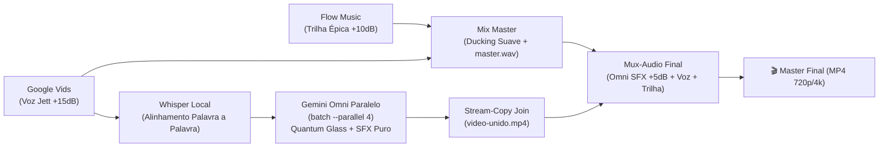

# 🏆 Receita de Ouro: Spot Cinematográfico Dark Obsidian & Quantum Glassmorphism

> **Identificador Canônico:** `spot-cinematico-omni-nativo`  
> **Aliases Válidos:** `preferida`, `receita-preferida`, `spot-preferido`, `ouro`, `quantum-glass`, `spot-quantum-glass`  
> **Classificação:** Receita de referência para spots comerciais  
> **Destino:** Criação de spots comerciais de alta conversão com tipografia 3D nativa e sound design cinematográfico.

---

## 1. Visão Geral da Arquitetura

Esta receita integra 4 motores em um pipeline coeso e auditável:



---

## 2. Parâmetros Acústicos & Multicamadas de Alta Presença

A assinatura sonora é construída em **3 camadas independentes e harmônicas**:

| Camada | Motor / Provedor | Ganho | Função Acústica |
| :--- | :--- | :--- | :--- |
| **1. Locução Principal** | Google Vids (`Jett` / `Kero` / `Zeno`) | `+11 dB` a `+15 dB` | Primeiro plano cristalino, autoridade institucional, inteligibilidade absoluta sem clipping. |
| **2. Trilha Sonora** | Flow Music | `+7 dB` a `+10 dB` | Base contínua com ducking suave (`threshold: 0.08, ratio: 7`), **sem corte e sem fade-out** (`fadeOut: 0`). |
| **3. Motion SFX Nativo** | Gemini Omni | `+5 dB` | Efeitos de movimento (*whooshes*, *sub-bass braams*, *cliques de UI*, *resonâncias vítreas*). |

---

## 3. Cadência Temporal & Regra de Ouro do Arremate (3 a 5 Segundos)

* **Cadência Ágil:** **2,4 a 2,6 palavras por segundo** (fala dinâmica para máxima retenção).
* **Regra de Ouro do Arremate Acústico:** A fala encerra **exatamente entre 3,0 e 5,0 segundos antes do fim da música** ($\Delta = D_{\text{trilha}} - D_{\text{voz}} \in [3,0\text{s}, 5,0\text{s}]$, ponto ideal: **4,0s**), permitindo que a trilha original do Flow Music execute seu acorde/batida final com volume pleno.
* **Segmentação em Blocos de 10s:** Em spots audiovisuais completos, o roteiro total é dividido em módulos de 10 segundos exatos para casar com os clipes nativos do Gemini Omni.

### Exemplo de Distribuição (Spot de 40 segundos):
* **Cena 1 (0s a 10s):** Gancho / Chamada de atenção e impacto inicial.
* **Cena 2 (10s a 20s):** Proposta de valor, metodologias e conteúdos chave.
* **Cena 3 (20s a 30s):** Informações de agenda (data, horário) e Call to Action (CTA).
* **Cena 4 (30s a 40s):** Assinatura de marca, autoridade institucional e clímax com stinger closure.

---

## 4. Conceito Visual: Dark Obsidian & Quantum Glassmorphism

* **Fundo:** Dark Obsidian / Matte Onyx Studio (`#030712`).
* **Chão:** Piso preto espelhado reflexivo (*glossy black mirror reflection floor*).
* **Tipografia:** Letras e blocos 3D em vidro translúcido lapidado com núcleo luminescente em azul cobalto (`#0066FF`) e Ciano Quântico (`#00F0FF`).
* **Iluminação:** Trilhos de luz laser, feixes volumétricos azuis e refrações prismáticas hiper-realistas.
* **Composição:** Limpa, geométrica, arquitetônica, **sem pessoas** e sem poluição visual.

---

## 5. Regras Críticas para o Gemini Omni

### A. Prompt Negativo Estrito de Áudio (Obrigatório em todas as cenas)
Para evitar que a IA tente vocalizar ou narrar o texto na tela, **todas as chamadas ao Omni devem incluir o cabeçalho**:
```text
[NEGATIVE AUDIO PROMPT: ABSOLUTELY NO NARRATION, NO VOICES, NO SPOKEN WORDS, NO SPEECH, NO TALKING, NO HUMAN VOCALS. AUDIO IS 100% PURE MOTION SOUND EFFECTS ONLY.]
```

### B. Cue Sheet Granular de SFX por Segundo
O prompt deve descrever os efeitos sonoros exatos sincronizados com os timestamps do Whisper:
* `At 0.0s-1.5s`: Heavy atmospheric riser + sub-bass braam impact on text reveal.
* `At 2.0s-4.5s`: High-tech laser whoosh + digital telemetry chimes.
* `At 4.8s-5.8s`: Electrical plasma pulse + deep sub-bass drop.
* `At 6.3s-10.0s`: Mechanical aperture snap + sustained crystalline harmonic chime.

---

## 6. Procedimento de Execução Passo a Passo (CLI)

### Passo 1: Síntese de Voz e Trilha Sonora (Audio Recipe)
```powershell
# Executar a receita de áudio preferida a partir do roteiro
npm run video -- audio-recipe `
  --preset spot-cinematico-omni-nativo `
  --script "caminho/do/roteiro.txt" `
  --collection spot-campanha-v1
```

### Passo 2: Alinhamento Temporal com Whisper
O comando gera automaticamente o alinhamento de palavras em `diagnosticos/voz.json` com os timestamps exatos de cada palavra.

### Passo 3: Montagem do Lote de Vídeo (`batch-jobs.json`)
Criar o arquivo `metadados/batch-jobs.json` contendo os 4 jobs com os prompts formatados, referência de banner e as diretivas de SFX/prompt negativo.

### Passo 4: Geração Paralela no Gemini Omni
```powershell
npm run video -- batch `
  --jobs "outputs/spot-campanha-v1/metadados/batch-jobs.json" `
  --out-dir "outputs/spot-campanha-v1/videos-soltos" `
  --parallel 4 `
  --confirm-provider-input true
```

### Passo 5: Concatenação Stream-Copy (`join`)
Criar o `assembly-manifest.json` com a lista dos vídeos soltos e executar:
```powershell
npm run video -- join `
  --mode studio `
  --manifest "outputs/spot-campanha-v1/metadados/assembly-manifest.json" `
  --out "outputs/spot-campanha-v1/videos-unidos/video-unido.mp4"
```

### Passo 6: Multiplexação e Masterização Multicamadas (`mux-audio`)
```powershell
npm run video -- mux-audio `
  --mode studio `
  --video "outputs/spot-campanha-v1/videos-unidos/video-unido.mp4" `
  --audio "outputs/spot-campanha-v1/audios-unidos/master.wav" `
  --preserve-video-audio true `
  --video-audio-gain +5dB `
  --out "outputs/spot-campanha-v1/videos-unidos/MASTER_FINAL.mp4"
```

### Passo 7: Validação Técnica (QA & Probing)
```powershell
ffprobe -i "outputs/spot-campanha-v1/videos-unidos/MASTER_FINAL.mp4"
```

---

## 7. Referências e Arquivos Canônicos no Repositório

* **Código do Preset:** `CORE/lib/media-pipeline/audio-recipe-presets.mjs`
* **Motor de Mixagem:** `CORE/lib/media-pipeline/audio-mix.mjs`
* **Contrato do Estúdio:** `AGENTS.md`
