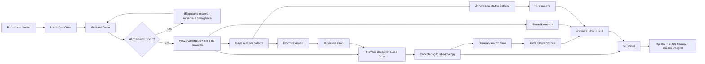

# Runbook UI SPACE — passagem de bastão para outra IA

> Guia operacional autocontido para reproduzir a linha artística **UI SPACE**:
> interfaces monumentais, composição limpa, narração envolvente, trilha Flow,
> efeitos estéreo e sincronização orientada por timestamps reais.

## 1. Objetivo

Produzir um filme horizontal de aproximadamente 100 segundos, composto por dez
capítulos de aproximadamente dez segundos, com:

- uma ideia de design de interface por capítulo;
- um único objeto visual heroico ocupando grande parte do quadro;
- narração brasileira íntima e cinematográfica;
- movimentos, tipografia e efeitos sonoros derivados da fala medida;
- trilha instrumental contínua gerada pelo Flow Music;
- montagem limpa, sem fade e sem regeneração corretiva automática;
- originais, stems, timestamps, manifestos e recibos preservados.

O filme de referência validado por este runbook é:

```text
outputs/ui-space-immersive-10x10-v1/videos-unidos/
  UI-SPACE-interface-imersiva-narracao-flow-master.mp4
```

Resultado técnico da referência:

| Propriedade | Resultado |
| --- | --- |
| Capítulos | 10 |
| Duração final | 100,065023 s |
| Formato | 16:9, 1280 × 720 |
| FPS | 24 |
| Frames decodificados | 2.400 |
| Áudio | AAC estéreo, 48 kHz |
| Alinhamento | Whisper Turbo, 10/10 |
| Trilha | Flow Music, uma faixa contínua |
| Efeitos | três âncoras estéreo por capítulo |
| Fade in/out | zero |
| Timing final | `pass` |
| Decodificação integral | `pass` |

## 2. Princípio central

> **A voz é a timeline. O vídeo e o som obedecem à voz.**

Não escrever prompts com timecodes imaginados. Não gerar todos os visuais e
tentar sincronizar depois. A ordem correta é:

1. escrever a narração;
2. gerar ou receber a voz;
3. transcrever e medir cada palavra;
4. corrigir somente o roteiro ou áudio antes dos visuais;
5. congelar os WAVs canônicos;
6. derivar os prompts visuais e efeitos dos timestamps aprovados;
7. gerar uma única passagem visual por capítulo;
8. substituir completamente o áudio criado pelo Omni;
9. unir as partes;
10. gerar a trilha para a duração real do vídeo unido;
11. mixar, ajustar a duração física, muxar e validar.

Se a IA inverter essa ordem, ela não está executando este método.

## 3. Arquitetura



## 4. Contratos obrigatórios

### 4.1 Autenticação

O workspace é cookie-only:

- usar o Windows Credential Manager;
- nunca usar `GEMINI_API_KEY`;
- nunca usar `--auth api`;
- nunca registrar cookies, tokens, headers ou HAR em prompt, recibo ou chat;
- Flow Music possui sessão própria;
- renovar sessão somente antes de um POST que comprovadamente ainda não começou.

### 4.2 Modos

- `raw`: uma chamada literal por clipe, preservando prompt, MP4 e recibo;
- `studio`: áudio, montagem, mix, efeitos, acabamento e QA local.

Os visuais UI SPACE são gerados uma única vez em `raw`. Toda composição posterior
é explícita e registrada como Studio.

### 4.3 Cota e repetição

- `batch generate` não deve criar rodadas corretivas;
- nunca repetir estado ambíguo, rejeição ou POST potencialmente aceito;
- um MP4 tecnicamente válido é preservado e entregue, mesmo se a estética puder
  ser refinada futuramente;
- edição ou regeneração estética só ocorre após novo pedido humano.

### 4.4 Áudio

- o áudio original dos visuais Omni é sempre descartado;
- a voz canônica é congelada antes dos visuais;
- `fadeIn: 0` e `fadeOut: 0`;
- o encerramento é corte limpo;
- a música deve deixar o centro espectral livre para a voz;
- efeitos devem ser esparsos, mensuráveis e vinculados a eventos.

## 5. Pré-voo

Executar em `CORE/`:

```powershell
npm run doctor
node scripts/omni-cli.mjs commands --format json
npm run video -- docs
npm run video -- help
npm run video -- styles --family motion-graphics --format json
npm run session -- status
```

Critérios:

- Node e FFmpeg disponíveis;
- sessão `google` classificada como `ready`;
- sessão `flow-music` classificada como `ready`;
- `gemini-omni` com `status: supported`;
- `flow-music` com `music-generate` e `status: supported`;
- `google-vids` com `text-to-speech` e `status: supported`;
- nenhuma rota alternativa de TTS ou música faz parte do produto.

O endpoint HTTP local pode aparecer como `unreachable`; isso não bloqueia o
adapter cookie-only do CLI quando as sessões e capacidades estão prontas.

## 6. Estrutura de pastas

Para uma coleção nova, nunca sobrescrever a referência. Criar outro nome:

```text
producoes/<nova-colecao>/
  README.md
  blocks.json
  narration-jobs.json
  flow-prompt.txt
  prompts-sync/
  visual-jobs.json
  prepare-sync.mjs
  remux-and-assemble.mjs
  finalize-master.mjs

outputs/<nova-colecao>/
  narracao-fonte/
  alinhamento/
    fonte/
    final/
  originais-omni/
  audio/
    sfx-partes/
  videos-soltos/
  videos-unidos/
  receitas/
  metadados/
```

Arquivos da produção de referência que devem ser estudados antes de adaptar:

```text
producoes/ui-space-immersive-10x10-v1/blocks.json
producoes/ui-space-immersive-10x10-v1/prepare-sync.mjs
producoes/ui-space-immersive-10x10-v1/remux-and-assemble.mjs
producoes/ui-space-immersive-10x10-v1/finalize-master.mjs
outputs/ui-space-immersive-10x10-v1/metadados/sync-preparation.json
outputs/ui-space-immersive-10x10-v1/metadados/relatorio-tecnico.json
```

## 7. Bíblia artística UI SPACE

### 7.1 Composição

- um único objeto heroico;
- objeto ocupando de 55% a 75% do quadro;
- no máximo dois elementos de apoio;
- muito espaço negativo;
- nenhuma parede de dashboard;
- nenhum HUD genérico;
- nenhum microtexto decorativo;
- nenhuma mão, pessoa ou mockup de dispositivo;
- geometria estável e identidade contínua dos objetos.

### 7.2 Paleta

- ambiente preto mineral;
- superfícies branco gelo;
- ciano luminoso como sinal principal;
- âmbar quente apenas para confirmação;
- vidro e profundidade com parcimônia;
- zero ruído de partículas.

### 7.3 Movimento

- frame zero limpo, mas já em movimento;
- uma câmera contínua e motivada;
- movimentos rápidos com leitura clara;
- profundidade espacial real;
- mudança de estado preservando o contexto;
- nenhum corte aleatório;
- nenhum poster ou preview no primeiro frame;
- corte seco no final.

### 7.4 Tipografia

- no máximo dois rótulos grandes por capítulo;
- texto desenhado nativamente nos pixels do vídeo;
- texto como arquitetura da interface, não como legenda;
- uma palavra de conceito e uma palavra de payoff;
- palavras completas;
- zero hífens;
- safe area de 12%;
- zero logotipo, marca, watermark ou legenda externa.

### 7.5 Voz

Direção de voz validada:

```text
Brazilian Portuguese from Brazil, neutral Brazilian accent, Brazilian cadence,
not European Portuguese; a deep, intimate, warm, full-bodied close-mic cinematic
narrator; confident, emotionally involving and deliberate, never shouted, with
soft breath and premium documentary presence.
```

Usar uma ideia por bloco, aproximadamente 10 a 14 palavras, deixando silêncio
antes e depois da frase.

### 7.6 Música

- eletrônica cinematográfica premium;
- cerca de 116 BPM;
- subgrave macio;
- synths aéreos;
- plucks de vidro;
- percussão digital limpa;
- transição estrutural a cada dez segundos;
- centro limpo para a voz;
- sem voz, canto, letra ou vocal chops;
- sem fade;
- impacto final limpo e resolvido.

## 8. Fase 1 — escrever os blocos

Criar `blocks.json`:

```json
[
  {
    "id": "ui-space-01-respiro",
    "text": "Quando tudo respira, a interface deixa de ocupar espaço e começa a conduzir."
  },
  {
    "id": "ui-space-02-foco",
    "text": "Um gesto claro vale mais do que dez caminhos competindo pela atenção."
  }
]
```

Regras:

- IDs únicos e ordenáveis;
- uma frase por capítulo;
- pontuação intencional;
- nenhuma frase longa demais para dez segundos;
- evitar números e siglas difíceis;
- escrever o texto que realmente deve ser falado.

## 9. Fase 2 — criar e gerar as narrações

Gerar os jobs:

```powershell
npm run video -- commercial --step narration-jobs `
  --blocks "producoes\<colecao>\blocks.json" `
  --out "producoes\<colecao>\narration-jobs.json"
```

O prompt de narração deve:

- usar tela quase preta e sem texto;
- declarar que o áudio é o hero;
- exigir a frase exata;
- proibir música e efeitos;
- pedir voz íntima, brasileira e close-mic;
- pedir aproximadamente 0,4 s de silêncio inicial;
- pedir silêncio depois da última palavra.

Gerar uma passagem:

```powershell
npm run video -- batch `
  --jobs "producoes\<colecao>\narration-jobs.json" `
  --parallel 3 `
  --out-dir "outputs\<colecao>\narracao-fonte"
```

Aceite:

- `summary.json` existe;
- total esperado de jobs;
- todos os MP4 aceitos ou falhas claramente registradas;
- recibo por MP4;
- nenhuma repetição automática.

## 10. Fase 3 — alinhar e aprovar a voz

Primeiro passe:

```powershell
npm run video -- align `
  --blocks "producoes\<colecao>\blocks.json" `
  --scenes-dir "outputs\<colecao>\narracao-fonte" `
  --out-dir "outputs\<colecao>\alinhamento\fonte" `
  --whisper-model turbo `
  --language pt `
  --lead-in 0.10 `
  --tail-out 0.22 `
  --gap 0.22 `
  --min-confidence 0.60
```

Arquivos importantes:

- `palavras-master.json`;
- `spans.json`;
- `alinhamento/<id>.json`;
- `alinhamento/<id>.wav`;
- `alinhamento.receipt.json`.

### 10.1 Como tratar divergências

| Achado | Ação |
| --- | --- |
| Grafia diferente, mesma palavra | Adotar grafia do roteiro mantendo o tempo medido |
| Artigo natural acrescentado e claramente falado | Atualizar o roteiro para a forma falada e executar novo alinhamento local |
| Palavra repetida, omitida ou trocada | Bloquear; não gerar visuais |
| Confiança baixa isolada, texto e ordem corretos | Manter como aviso se o relatório final estiver `pass` |
| Dúvida real | Confirmar com modelo Whisper mais forte antes de qualquer nova geração |

No filme de referência, a voz disse “preservam **o** contexto”. O roteiro foi
atualizado para refletir a fala e apenas o alinhamento local foi repetido.

Executar o passe final em outra pasta:

```powershell
npm run video -- align `
  --blocks "producoes\<colecao>\blocks.json" `
  --scenes-dir "outputs\<colecao>\narracao-fonte" `
  --out-dir "outputs\<colecao>\alinhamento\final" `
  --whisper-model turbo `
  --language pt `
  --lead-in 0.10 `
  --tail-out 0.22 `
  --gap 0.22 `
  --min-confidence 0.60
```

Trava:

```text
alignment.status == "pass"
alignment.blocks.length == 10
todos os blocos com status == "pass"
```

## 11. Fase 4 — congelar voz e timeline

O script `prepare-sync.mjs` executa quatro operações:

1. lê os JSONs Whisper aprovados;
2. adiciona 0,5 s de proteção inicial a cada WAV;
3. desloca todos os timestamps pelo mesmo valor;
4. publica WAV, mapa de palavras, prompts, SFX e manifesto.

Contrato de cada voz:

```text
PCM 16-bit
48 kHz
mono
10,005 s
lead-in técnico: 0,5 s
```

Exemplo FFmpeg:

```powershell
ffmpeg -y -i alinhamento.wav `
  -af "adelay=500|500,apad" `
  -t 10.005 -ar 48000 -ac 1 -c:a pcm_s16le voz-canonica.wav
```

O mapa publicado deve declarar:

```json
{
  "schema": "mkt-videos/measured-word-timestamps@1",
  "id": "ui-space-01-respiro",
  "leadInSeconds": 0.5,
  "durationSeconds": 10.005,
  "words": [
    { "word": "Quando", "start": 0.5, "end": 1.18, "confidence": 0.99 }
  ]
}
```

Executar:

```powershell
node "producoes\<colecao>\prepare-sync.mjs"
```

Aceite:

- dez WAVs de aproximadamente 10,005 s;
- dez mapas de palavras;
- dez prompts;
- dez stems de efeitos;
- `sync-preparation.json`;
- `inventedTimestamps: false`;
- última palavra antes de 9,70 s.

## 12. Fase 5 — efeitos estéreo medidos

Cada capítulo usa três âncoras:

1. **início**: primeira palavra — pulso subgrave;
2. **meio**: palavra central — deslocamento aéreo;
3. **final**: início da última palavra — confirmação cristalina.

Os lados alternam por capítulo para criar movimento espacial sem confundir o
centro da voz.

Desenho-base:

```text
pulso:       seno de 62–89 Hz, curto, volume baixo
deslocamento: ruído rosa filtrado entre 700 e 6.500 Hz
confirmação: seno de 620–926 Hz, curto e cristalino
```

Exemplo de grafo:

```text
[sub] volume + fade curto + pan + adelay(firstWord)
[air] highpass + lowpass + fade + pan oposto + adelay(middleWord)
[confirm] highpass + fade + pan + adelay(lastWord)
[sub][air][confirm] amix + apad
```

Usar `-t 10.005` na saída. Não depender apenas de `atrim` após `apad`, porque
algumas combinações de filtros podem escrever o silêncio final lentamente.

Depois, concatenar os dez stems em:

```text
audio/ui-space-sfx-master.wav
```

## 13. Fase 6 — compilar os prompts visuais

O prompt de cada capítulo precisa conter:

1. duração, aspecto e FPS;
2. `ONE HERO ONLY`;
3. paleta UI SPACE;
4. frame zero limpo;
5. contrato audio-first;
6. três fases visuais medidas;
7. mapa completo de palavras como evidência temporal;
8. somente dois rótulos nativos grandes;
9. margem final;
10. proibições estritas.

Template:

```text
Create exactly one 10.00-second premium cinematic UI motion film,
wide 16:9, 24 fps.

ONE HERO ONLY
<um objeto ocupando 55% a 75% do quadro>.

FRAME ZERO
Frame zero is clean and already moving through depth, with no visible text.

AUDIO-FIRST CONTRACT
The narration is frozen. Visual changes and local stereo effects use the same
measured timestamps. Do not create usable narration, music or vocals.

MEASURED MOTION PHASES
- [a-b] <movimento 1>
- [c-d] <movimento 2>
- [e-f] <movimento 3>

MEASURED WORD MAP
- [start-end] PALAVRA

NATIVE TYPOGRAPHY
Render only "<CONCEITO>" and "<PAYOFF>" as very large native interface labels.

STRICT RULES
Twelve percent safe area. Zero hyphens. Zero logos, brands, watermark,
captions, source code or decorative microtext. No fade. No random cuts.
```

O mapa de palavras dirige micro-movimentos, mas não vira legenda. A tela mostra
somente o conceito e o payoff.

## 14. Fase 7 — gerar os visuais

`visual-jobs.json`:

```json
[
  {
    "id": "ui-space-01-respiro-sync",
    "promptFile": "prompts-sync/ui-space-01-respiro.txt",
    "aspect": "16:9",
    "mode": "raw"
  }
]
```

Executar:

```powershell
npm run video -- batch `
  --jobs "producoes\<colecao>\visual-jobs.json" `
  --parallel 3 `
  --out-dir "outputs\<colecao>\originais-omni"
```

Não usar o áudio desses MP4 como fonte final.

## 15. Recuperação de falhas

### 15.1 Matriz de decisão

| Situação | Pode repetir? | Ação |
| --- | --- | --- |
| MP4 válido e recibo válido | Não | Preservar e seguir |
| `Input blocked` ou rejeição do provedor | Não | Registrar e parar |
| Timeout ou erro após possível POST | Não | `status`/`reconcile`; não iniciar nova chamada |
| Há interaction, attempt, recibo parcial ou estado ambíguo | Não | Reconciliar |
| Falha local comprovadamente antes do POST, sem attempt, interaction, recibo ou arquivo | Uma chamada isolada pode ser segura | Renovar sessão, executar somente o job ausente e registrar a reconciliação |
| Falha FFmpeg local | Sim, localmente | Corrigir o processo local sem tocar no provedor |

### 15.2 Caso real do UI SPACE

O capítulo seis falhou com:

```text
Cookies Google ausentes no Gerenciador de Credenciais.
```

Evidências:

- worker encerrou em aproximadamente 2,7 s;
- nenhum MP4;
- nenhum recibo;
- nenhum interaction;
- nenhum attempt;
- outros jobs continuaram;
- a sessão foi relida como `ready`.

Como o POST nunca começou, o capítulo foi gerado uma única vez, isoladamente,
em uma pasta de reconciliação. O relatório técnico registra:

```json
{
  "isolatedPrePostCredentialRecovery": {
    "providerAttemptInOriginalFailure": false,
    "recoveredWithSingleIsolatedGeneration": true
  },
  "automaticProviderRetries": 0
}
```

Essa exceção não autoriza retry quando houver dúvida sobre o envio.

## 16. Fase 8 — substituir áudio e unir

Para cada visual:

```text
entrada 0: MP4 Omni
entrada 1: WAV canônico
saída: vídeo copiado + áudio AAC
```

Exemplo:

```powershell
ffmpeg -y -i visual.mp4 -i voz-canonica.wav `
  -map 0:v:0 -map 1:a:0 `
  -c:v copy -c:a aac `
  -t 10.005 -movflags +faststart parte-narrada.mp4
```

O script validado é:

```powershell
node "producoes\<colecao>\remux-and-assemble.mjs"
```

Ele:

- descarta o áudio Omni;
- publica recibo por capítulo;
- exige streams compatíveis;
- concatena em ordem por stream-copy;
- executa `ffprobe`;
- executa decodificação integral;
- publica manifesto e recibo de montagem.

Resultado intermediário:

```text
videos-unidos/<colecao>-unido.mp4
```

Medir a duração real desse arquivo. No UI SPACE ela foi 100,071333 s.

## 17. Fase 9 — gerar a trilha Flow

Criar `flow-prompt.txt` com:

- arco de aproximadamente cem segundos;
- dez passagens internas;
- espaço para voz;
- profundidade estéreo;
- zero voz e vocal chops;
- zero fade;
- impacto final limpo.

Gerar para a duração real do vídeo:

```powershell
npm run video -- music `
  --mode studio `
  --backend flow-music `
  --prompt-file "producoes\<colecao>\flow-prompt.txt" `
  --duration <duracao-real> `
  --out "outputs\<colecao>\audio\ui-space-flow.wav" `
```

Preservar:

- WAV master;
- original do provedor;
- recibo;
- arquivo de attempt.

Nunca repetir automaticamente um estado ambíguo do Flow.

## 18. Fase 10 — montar voz e mixar

Concatenar os dez WAVs canônicos em ordem para criar:

```text
audio/narracao-master-100s.wav
```

Mix validado:

```powershell
npm run video -- mix `
  --mode studio `
  --voice "outputs\<colecao>\audio\narracao-master-100s.wav" `
  --music "outputs\<colecao>\audio\ui-space-flow.wav" `
  --ambience "outputs\<colecao>\audio\ui-space-sfx-master.wav" `
  --music-gain 0.11 `
  --ambience-gain 0.30 `
  --ducking-threshold 0.08 `
  --ducking-ratio 8 `
  --fade-in 0 `
  --fade-out 0 `
  --out "outputs\<colecao>\audio\ui-space-immersive-mix.wav"
```

Valores da referência:

| Métrica | Valor |
| --- | --- |
| Música | 0,11 |
| Efeitos | 0,30 |
| Ducking ratio | 8 |
| Loudness integrado | −15,8 LUFS |
| True peak | −4,5 dB |
| Clipping | não |

Esses ganhos são ponto de partida validado, não lei estética universal.

## 19. Fase 11 — ajustar duração, muxar e validar

O áudio mixado deve ser ajustado à duração física do vídeo unido, sem fade. O
script de referência usa `fitMusicToDuration` e `muxMasterAudio`:

```powershell
node "producoes\<colecao>\finalize-master.mjs"
```

Ele deve:

1. medir vídeo e mix;
2. cortar ou completar a mix para a duração exata;
3. muxar vídeo por stream-copy e áudio em AAC 192 kbps;
4. confirmar 2.400 frames;
5. confirmar áudio iniciando em zero;
6. confirmar coexistência das faixas;
7. decodificar o master integralmente;
8. publicar `timing-report.json`;
9. publicar `relatorio-tecnico.json`;
10. publicar recibo do master.

Validação manual equivalente:

```powershell
ffprobe -v error `
  -show_entries format=duration,size,format_name:stream=index,codec_name,codec_type,width,height,r_frame_rate,sample_rate,channels `
  -of json "master.mp4"

ffprobe -v error -count_frames -select_streams v:0 `
  -show_entries stream=nb_read_frames `
  -of json "master.mp4"

ffmpeg -hide_banner -loglevel error -i "master.mp4" -f null NUL
```

## 20. Definition of Done

Uma entrega está concluída somente quando:

- [ ] dez blocos de roteiro;
- [ ] dez narrações fonte preservadas;
- [ ] alinhamento final `pass`;
- [ ] dez WAVs canônicos;
- [ ] timestamps derivados do Whisper, nunca inventados;
- [ ] dez prompts visuais;
- [ ] dez visuais originais com recibo;
- [ ] áudio Omni descartado;
- [ ] dez vídeos narrados;
- [ ] concatenação stream-copy aprovada;
- [ ] uma trilha Flow com recibo;
- [ ] um master de efeitos estéreo;
- [ ] mix sem clipping;
- [ ] fade in e fade out iguais a zero;
- [ ] 2.400 frames;
- [ ] áudio estéreo a 48 kHz;
- [ ] timing `pass`;
- [ ] decodificação integral `pass`;
- [ ] recibo principal;
- [ ] relatório técnico;
- [ ] vídeo e coleção entregues por caminhos absolutos.

## 21. O que não fazer

- Não inventar timecodes.
- Não gerar visuais antes de aprovar a voz.
- Não usar o áudio dos visuais Omni.
- Não transformar o mapa completo em legenda.
- Não colocar dez componentes pequenos onde um objeto grande resolve.
- Não criar dashboard wall, HUD, partículas ou microtexto decorativo.
- Não usar fade automático.
- Não inspecionar frames para iniciar regeneração autônoma.
- Não usar OCR, volume ou QA para escolher uma “versão melhor”.
- Não repetir POST ambíguo.
- Não sobrescrever original, stem, recibo ou master.
- Não esconder recuperação de falha.
- Não declarar sincronismo apenas porque o prompt contém timecodes; exigir
  evidência do Whisper e relatório final.

## 22. Entrega para o usuário

Responder de forma curta:

1. título e sinopse;
2. quantidade de capítulos;
3. duração;
4. estado do alinhamento e QA;
5. link absoluto do master;
6. link absoluto da coleção;
7. link absoluto do recibo principal.

Não despejar prompts, IDs, cookies, tokens ou logs no chat.

## 23. Prompt pronto para entregar a outra IA

Copie o texto abaixo junto deste runbook:

```text
Você recebeu a responsabilidade de continuar a linha artística UI SPACE dentro
do workspace GERADOR DE VIDEOS.

Leia integralmente:
1. AGENTS.md do workspace;
2. CORE/docs/AGENT-CONTRACT.md;
3. CORE/docs/guias/RUNBOOK-UI-SPACE-AUDIO-FIRST-IMERSIVO.md;
4. os scripts e metadados da coleção
   CORE/producoes/ui-space-immersive-10x10-v1 e
   CORE/outputs/ui-space-immersive-10x10-v1.

Objetivo: criar uma coleção nova, sem sobrescrever a referência, preservando a
linha UI SPACE: composição limpa, objetos monumentais, espaço negativo, uma
câmera contínua, tipografia nativa mínima e grande, voz brasileira íntima,
trilha Flow contínua e efeitos estéreo derivados dos mesmos timestamps.

Fluxo obrigatório:
roteiro -> narração -> Whisper 10/10 -> WAV canônico -> timestamps -> prompts e
SFX -> visuais Omni -> descarte do áudio Omni -> concatenação -> Flow -> mix ->
fit -> mux -> QA técnico.

Não invente timecodes. Não gere visuais antes do alinhamento. Não use fade. Não
repita chamadas ambíguas ou rejeitadas. Preserve todos os originais e recibos.
Faça uma única passagem por clipe. Entregue somente após ffprobe, contagem de
frames, coexistência de faixas e decodificação integral.
```

## 24. Referências locais

- `docs/AGENT-CONTRACT.md`
- `docs/guias/MANUAL-ANIMACAO-TIPOGRAFICA-NATIVA-OMNI.md`
- `docs/guias/MANUAL-FILME-NARRADO.md`
- `docs/guias/PESQUISA-REACT-AUDIOVISUAL.md`
- `producoes/ui-space-immersive-10x10-v1/README.md`
- `producoes/ui-space-immersive-10x10-v1/blocks.json`
- `producoes/ui-space-immersive-10x10-v1/prepare-sync.mjs`
- `producoes/ui-space-immersive-10x10-v1/remux-and-assemble.mjs`
- `producoes/ui-space-immersive-10x10-v1/finalize-master.mjs`
- `outputs/ui-space-immersive-10x10-v1/metadados/sync-preparation.json`
- `outputs/ui-space-immersive-10x10-v1/metadados/timing-report.json`
- `outputs/ui-space-immersive-10x10-v1/metadados/relatorio-tecnico.json`
- `outputs/ui-space-immersive-10x10-v1/receitas/UI-SPACE-master.receipt.json`

---

Este runbook descreve o processo validado em 30 de julho de 2026. Capacidades,
sessões, modelos e comandos são fatos voláteis: a próxima IA deve renovar
`docs`, `help`, `styles` e `session status` antes de operar.
